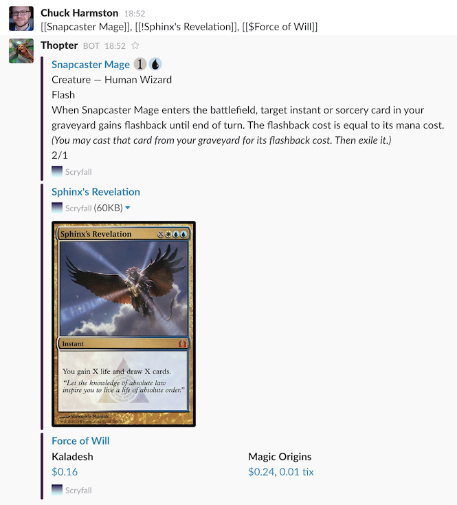
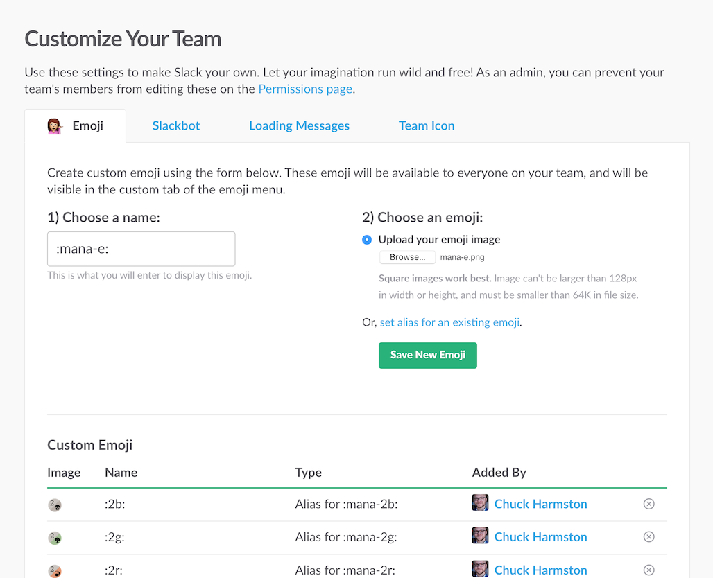

**Thopter is deprecated now that we have a [shiny new centralized bot](https://scryfall.com/bots), but it should still work fine if you’d like to host (or tweak) your own.**

# thopter

Slackbot to unfurl MTG cards from [scryfall.com](https://www.scryfall.com).


## Features

While referring to a Magic: the Gathering card on Slack, surround its name with
brackets (`[[` and `]]`) and prepend with an optional token. Thopter will print
out a the text of that card, its image, or its prices:

| Command                    | Function                                                         |
|----------------------------|------------------------------------------------------------------|
| `[[Snapcaster Mage]]`      | Show a text representation of Snapcaster Mage.                   |
| `[[!Sphinx's Revelation]]` | Show an picture of Sphinx's Revelation.                          |
| `[[$Force of Will]]`       | Show prices for printings of Force of Will (currently FPO data). |




## Setup

1. Create a new [custom integration](https://webnerdery.slack.com/apps/build/custom-integration) of the 'Bot' type in your Slack. We recommend naming it "Thopter".
2. Get its API token and memorize it.
3. Clone the repository

   ```
   git clone https://github.com/scryfall/thopter.git
   cd thopter
   ```

4. Install the [Heroku CLI](https://devcenter.heroku.com/articles/heroku-command-line) for your platform.
5. Set up your app on Heroku:

   ```
   heroku login
   heroku create
   heroku ps:scale web=0:free
   heroku ps:scale worker=1:free
   heroku config:set SLACK_TOKEN=<the slack token you memorized above>
   ```

6. Push to Heroku:

   ```
   git push heroku master
   ```

7. Invite the bot to any channels where you want it to participate.


### Manamoji

Thopter will graphical symbols in a format that looks like `:mana-u:`. To transform them to their visual equivalent, you can [create custom emoji](https://webnerdery.slack.com/customize/emoji) for your Slack organization for each symbol. These are all contained within the `manamoji` directory of this repository, and should be given a Slack name corresponding to its file name (e.g. the file `mana-e.png` should be named `:mana-e:` in Slack):




## Development

To develop Thopter, the steps are similar, only you run the instance locally instead of from Heroku.

To set up a development environment:

```
npm install
SLACK_TOKEN=<the slack token you memorized above> DEBUG=true npm start
```

Pro tips:

- It's recommended that you have a separate test bot ("Servo" is a great name) and channel for testing.
- After making changes, you will need to restart the bot to see them reflected.

